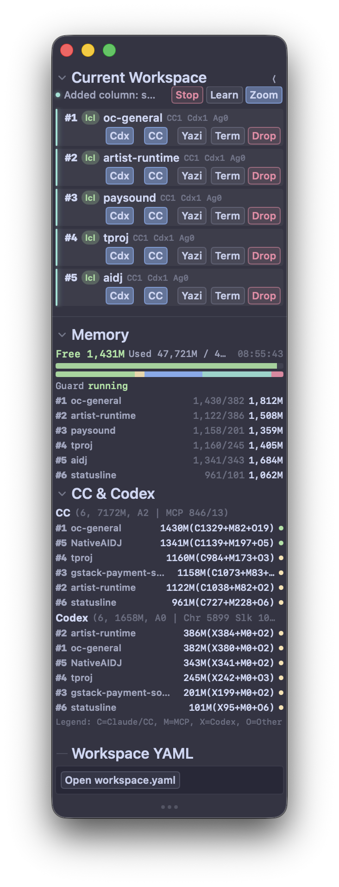

# tproj

A tmux-based AI workspace orchestrator for [Claude Code](https://github.com/anthropics/claude-code) and [Codex](https://github.com/openai/codex).

Spin up a structured terminal layout with Claude Code and Codex side by side, with AI-generated persona, pane backgrounds, inter-AI messaging, and a native macOS GUI — all managed from a single command.

<p align="center">
  
</p>

## Quick Start

```bash
git clone https://github.com/usedhonda/tproj.git
cd tproj
./install.sh        # install CLI + extensions
tproj init          # interactive setup wizard
tproj               # launch workspace
```

## Features

- **Single-project mode** — 3-pane layout: Claude Code + Codex + yazi
- **Multi-project workspace** — column-based layout across multiple projects from `workspace.yaml`
- **Native macOS GUI** — SwiftUI app with session management, memory monitoring, Ghostty snap
- **AI Persona system** — deterministic personality, profession, era, and character type per project
- **Pane backgrounds** — AI-generated character art (Gemini) for each CC/Cdx pane
- **Inter-AI messaging** — `tproj-msg` for CC ↔ Cdx ↔ cross-project communication
- **Agent Teams** — Claude Code Agent Teams pane management with auto-reflow
- **Remote SSH** — launch the same layout on a remote host

## Requirements

- **macOS** (CLI core works on any tmux-capable OS; GUI app is macOS-only)
- [Claude Code](https://github.com/anthropics/claude-code) + [Codex](https://github.com/openai/codex)
- tmux, yazi, bat, yq, jq, node/npm, git
- Recommended terminal: [Ghostty](https://ghostty.org)

Dependencies are checked and can be auto-installed during `tproj init`. Homebrew is
required only for that automatic dependency installation; otherwise install the
listed tools manually.

## What needs what

tproj's core (tmux layout + CLI) runs on the base dependencies alone. Optional
features degrade gracefully ("fail open") when their component is missing:

| Feature | Requires | If missing |
|---------|----------|------------|
| tmux layout + panes | tmux, yq, jq | core — required |
| Inter-AI messaging (`tproj-msg`) | core only | — |
| Real-time inbox monitor | `sqlite3` | monitor disabled, sending still works |
| WebSocket idle detection | `websocat` + `timeout`/`gtimeout` | falls back to tmux prompt heuristic |
| Native GUI app | built `tproj.app` | CLI workspace continues without it |
| Pane backgrounds | `project-bootstrap` + Gemini API key | no background art |
| Voice alerts | VOICEVOX / `say` | silent |
| Gate / Chi bridge | ClawGate at `localhost:8765` | only the `gate` target is affected |

## Install

### From source (recommended)

```bash
git clone https://github.com/usedhonda/tproj.git
cd tproj
./install.sh           # core + default extensions
./install.sh --dry-run  # preview only
./install.sh --core-only  # minimal
./install.sh --all      # everything including memory daemon
```

Run `./install.sh -h` for all options.

This installs CLI tools in `~/bin/`, config files (`~/.tmux.conf`, `~/.config/yazi/`),
and extensions (messaging, persona, agent-teams). The native GUI app is **not** built
by `install.sh` — see [GUI App](#gui-app) to build it from source.

### Homebrew (maintainer distribution)

> **Note:** The Homebrew tap is currently a private maintainer channel and is **not**
> available for public `brew install`. Use the from-source path above. The cask is
> published only as part of the maintainer release pipeline; the commands below work
> once (or if) the tap is made public.

```bash
brew tap usedhonda/tproj
brew install --cask tproj
```

When installed this way, the cask also places `tproj.app` in `/Applications`.

## Setup

After installation, run the interactive setup wizard:

```bash
tproj init
```

This will:
1. Check and install missing dependencies (brew packages)
2. Generate `~/.config/tproj/workspace.yaml` with your first project
3. Configure Claude Code SessionStart hooks for persona generation
4. Verify `~/bin` is in your PATH

Verify your environment anytime:

```bash
tproj --check
```

### Optional: Gemini API key for pane backgrounds

Pane background art (the persona portraits) is generated via Google's Gemini API.
To enable it, get a key from <https://aistudio.google.com/apikey> and export it:

```bash
export GEMINI_API_KEY="your-key-here"   # add to your shell profile (~/.zshrc, etc.)
```

Without a key, tproj runs normally — panes just have no background art (fail-open).
The art style defaults to a generic hand-drawn anime look; to customize it, create
`~/.config/tproj/pane-bg.local` and set `TPROJ_PANE_BG_STYLE_REF_EN` / `_REF_JP` /
`_AUTHOR_JP` (machine-local, never committed).
For per-project prompt tuning, create `<project>/.local/tproj-pane-bg/prompt.local.json`;
`.local/` is ignored by git, and the generated sidecar records which override was used.

## Usage

```bash
tproj                 # start workspace (auto-detects workspace.yaml)
tproj --single        # force single-project mode
tproj --remote <host> # SSH remote connection
tproj --check         # health check: dependencies, config, hooks
tproj --add <alias>   # add a project column from workspace.yaml
tproj --columns 3     # start only the first 3 projects
tproj stop            # graceful shutdown
tproj kill            # force kill all sessions
```

## Workspace Configuration

`tproj init` generates `~/.config/tproj/workspace.yaml`. Edit it to manage your projects:

```yaml
projects:
  - path: /path/to/your/frontend
    alias: fe

  - path: /path/to/your/backend
    alias: be

  - path: /path/to/your/infra
    alias: infra
    enabled: false   # available via --add but not started by default
```

See `config/workspace.yaml.example` for the full field reference.

## GUI App

A native SwiftUI app for session control and monitoring. Features:
- Workspace project list with drag-and-drop column reordering
- Memory usage monitoring with per-column breakdown
- CC & Codex process status
- Collapsible sections with persistent state
- Ghostty window snap with resize control
- Window size persistence across restarts

The GUI auto-launches when `tproj` starts a session **if the app is installed**.
A from-source install does not build the app automatically — build it once from
`apps/tproj`:

```bash
cd apps/tproj
./dev-app.sh           # debug build + launch
./dev-app.sh --release # release build (universal binary + app bundle)
```

Without the built app, `tproj` still runs the full tmux/CLI workspace and prints a
one-line notice that the GUI was not found — core functionality is unaffected.

## Extensions

| Extension | What it does | Default |
|-----------|-------------|---------|
| **messaging** | Inter-pane AI messaging (`tproj-msg`) + `msg` skill for Claude Code/Codex | yes |
| **persona** | Deterministic AI persona generation (personality, profession, era) + pane background art | yes |
| **agent-teams** | Claude Code Agent Teams pane management with auto-reflow | yes |
| **memory** | Memory monitoring + watchdog daemon (macOS launchd) | opt-in |

### Persona System

Each project gets a unique AI personality generated from a deterministic hash:
- **CC** (always female): tone, character type, profession, era, relationship stance
- **Cdx** (always male): independent personality with different attribute pools

Professions (CC): 巫女, 踊り子, 薬師, ナース, メイド, 歌姫, 占い師, 花魁, 女騎士, 魔女
Eras: 戦国, 大航海時代, サイバーパンク, 電脳都市, 蒸気未来, 深海都市, 軌道コロニー, and more

Pane backgrounds are AI-generated character art (via Gemini) reflecting each persona.

### Inter-AI Messaging

```bash
tproj-msg cc "question"              # message same-column CC
tproj-msg sl.cdx "review request"    # message specific column's Cdx
tproj-msg --status sl.cc             # check if target is available
```

## Extension Hooks

| Environment variable | Purpose | Example |
|---------------------|---------|---------|
| `TPROJ_LABEL_HOOK` | Pane label generator | `export TPROJ_LABEL_HOOK=project-bootstrap` |
| `TPROJ_AFTER_LAYOUT_HOOK` | Post-layout hook | `export TPROJ_AFTER_LAYOUT_HOOK=tproj-pane-bg` |
| `TPROJ_GUI_APP_PATH` | Override GUI app location | `export TPROJ_GUI_APP_PATH=~/Apps/tproj.app` |

## Repository Layout

```
bin/                            core scripts
  tproj                           main launcher (init, check, stop, kill)
  tproj-drop-column               batch column removal
  tproj-toggle-yazi               yazi pane toggle
  rebalance-workspace-columns     column width equalizer
config/                         core configuration
  tmux/tmux.conf                  tmux settings
  yazi/                           yazi file manager config + plugins
  workspace.yaml.example          workspace template
apps/tproj/                     SwiftUI GUI app
  Sources/TprojApp/               app source (single-file SwiftUI)
  scripts/release.sh              release pipeline (build → sign → DMG → notarize → publish)
extensions/                     optional extensions
  messaging/                      tproj-msg + msg skill
  persona/                        project-bootstrap + tproj-pane-bg + voicevox-alert
  agent-teams/                    team-watcher + reflow-agent-pane
  memory/                         cc-mem + memory-guard daemon
docs/                           documentation
  release/                        release notes
```

## Uninstall

From-source install — remove the CLI scripts and the built app, keeping your config:

```bash
rm -f ~/bin/tproj ~/bin/tproj-* ~/bin/rebalance-workspace-columns
rm -rf apps/tproj/dist          # only if you built the GUI app
```

Your tmux/yazi configs were backed up at install time (`~/.tmux.conf.bak.*`,
`~/.config/yazi/*.bak.*`) — restore them if you want. User config
(`~/.config/tproj/`, `~/.claude/`) is preserved.

Homebrew install (maintainer channel):

```bash
brew uninstall --cask tproj
brew untap usedhonda/tproj
```

## Notes

- tproj does not run `npm update` automatically. Update manually:
  ```bash
  npm update -g @anthropic-ai/claude-code @openai/codex
  ```
- For heavy multi-pane usage in Ghostty, consider lowering `scrollback-limit` (e.g. `3000`) to reduce memory pressure.

## License

MIT
