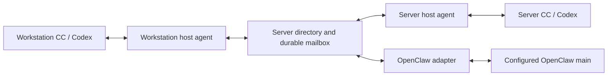

# Unified agent messaging: v1 contract and implementation plan

Status: proposed design, not an active runtime contract. No installation,
configuration migration, service restart, or live send is authorized by this
document alone. Implementation starts only on a subsequent implementation
instruction. Existing routing contracts remain authoritative until cutover.

## 1. Outcome and architecture decision

Make local and remote CC/Codex sessions and a configured OpenClaw main agent
participants in one messaging system. Keep `tproj-msg` as the user-facing CLI.
An agent addresses a participant, not an SSH host, terminal, callback URL, or
transport adapter. Moving a participant must not change its conversational name.

Use one always-on server-owned directory and durable mailbox. Both hosts run a
small host agent which authenticates local callers and delivers to local
endpoints. The OpenClaw adapter is another endpoint, not a separate reply system.
The GUI is a client, never the message broker or a requirement for delivery.

V1 selection: a bounded Python/SQLite mailbox service over private Unix sockets
and existing SSH transport. Reuse audited local caller binding and terminal
sendability checks, not the current route-specific dispatch trees. The durable
store uses transactions and WAL with synchronous FULL; acceptance follows a
successful commit. There is one broker, no federation or consensus protocol.
This is new application code to maintain, not a claim that existing helpers
already implement this design.

The workstation keeps an SSH local-socket forward to the server hub. The server
host agent connects locally. Socket directories are owner-only and socket files
are mode 0600. Clients only contact their local host-agent socket;
they do not run SSH per message. SSH host checking is retained. Each host agent
has an enrolled credential binding it to its stable host ID. Only the server hub
stores canonical aliases and authoritative delivery state. Local receipt journals
are allowed for crash recovery; they are not independent address directories.

### Alternatives and selection rationale

| Candidate | Useful capability | V1 decision |
|---|---|---|
| Existing routing as-is | Working local injection, caller binding, some remote routes | Reuse boundary checks; replace dispatch and reply addressing. It has no single durable acceptance boundary. |
| MCP Agent Mail | Hosted directory, inboxes, threads, read/ACK metadata | Not selected. Its documented naming rules and hook-driven inbox reminders still require tproj identity and live delivery adapters; OpenClaw integration and required idempotency are not demonstrated. Git-backed message archiving and additional workflow features are not needed here. |
| A2A | Standard agent discovery, messages, tasks, streaming | Defer. Current interactive panes do not expose A2A servers. Adapters and mailbox persistence would still be needed. Do not implement a partial A2A dialect and label it interoperable. |
| NATS JetStream | Durable delivery, consumers, acknowledgements | Defer. It can replace the mailbox transport when scale requires it, but does not remove the endpoint/authority adapters. For two hosts, a broker plus a separate directory/receipt service adds another operational component. |
| MCP | Standard interface for agent-accessible tools | Optional later interface to the same mailbox, not a second communication system. Existing CLI remains sufficient for v1. |

The Agent Mail license includes an OpenAI/Anthropic rider. This is an unresolved
licensing consideration, not a finding that every end-user of CC/Codex is legally
barred. The technical selection above does not depend on that interpretation.
No candidate was installed or proven compatible by this documentation review.

Sources consulted:
- [Agent Mail README](https://github.com/Dicklesworthstone/mcp_agent_mail): identities, persistence, configuration, automatic inbox reminders.
- [Agent Mail license](https://github.com/Dicklesworthstone/mcp_agent_mail/blob/main/LICENSE).
- [A2A specification](https://a2a-protocol.org/latest/specification/): discovery, messages/tasks, streaming, idempotency.
- [NATS JetStream consumers](https://docs.nats.io/learn/jetstream/pull-consumers): consumer acknowledgements and redelivery.
- [MCP architecture](https://modelcontextprotocol.io/docs/2026-07-28/learn/architecture): client/server tool integration.

## 2. Names, directory ownership, and authority

- Assign stable opaque IDs to hosts, projects, participants, and live endpoint
  incarnations. Hostnames, paths, aliases, pane numbers, models, and role epochs
  are attributes, not interchangeable identity keys.
- Keep public project addresses `<project>.cc` and `<project>.cdx`. Bare `cc` or
  `cdx` resolves inside the authenticated sender's project only. Cross-project
  addressing requires the full address; there is no focused-pane fallback.
- `gate` denotes the configured OpenClaw main participant. A project with a
  similar name remains an unrelated CC/Codex project. The OpenClaw adapter binds
  the configured gateway/account/agent identity, not a display prefix.
- New sends resolve an alias once at the hub and pin the destination incarnation.
  Replies use the original message ID, original sender endpoint, and thread ID;
  neither alias edits nor focus changes can change that reply destination.
- Alias rename is one atomic directory update. No dual aliases, server-generated
  suffixes, or persistent compatibility aliases. An alias cannot be reassigned
  to another participant in v1. Host/path moves require explicit registration
  updates, not rediscovery from a matching basename.
- If more than one current endpoint competes for one participant, resolution
  returns `ambiguous_target`. It never picks the newest or focused pane.

**Deliberate configuration change:** the server directory becomes the alias
master. Existing workstation YAML aliases are imported once; thereafter local
workspace YAML owns layout, launch paths and enabled state, with stable project
references. It is not a competing routing authority. Directory edits from either
host use the same revision-checked service operation. A YAML edit view may be
exported/imported through that operation, but edited copies are not live masters.
GUI alias editing must call this operation before the new workflow is complete.
No migration or deletion of current YAML fields happens during design work.

Host agents bind callers using the existing live process ancestry, PID-start,
project and session registration evidence. `--session`/`--as` are selectors to
validate, not credentials. An arbitrary SSH shell cannot impersonate an agent.
The hub trusts enrolled host adapters within this single-operator trust boundary;
it does not claim isolation from a malicious same-UID host owner.

Ordinary chat carries no role-changing or implementation authorization. Existing
task and role-handoff validators remain the authority for those operations and
may use the shared transport only after validation. Cross-host control operations
currently forbidden remain forbidden; never downgrade them into ordinary chat.
CC/Codex labels identify platforms, not working-role authority.

## 3. Message, delivery, and CLI contract

### Required envelope and operations

The versioned envelope contains `message_id`, `thread_id`, optional `in_reply_to`,
authenticated `sender_endpoint`, pinned `recipient_endpoint`, `kind`, UTF-8 body,
creation/expiry timestamps and directory revision. Endpoint records contain
host/project/participant/incarnation; role authority is separate validated task
metadata, not inferred from the text. Maximum body size is 64 KiB in v1; larger
messages fail before acceptance. Preserve newlines and literal shell characters.

Operations: resolve/list participants; submit a new message; reply to a message;
read one's own inbox; record delivery evidence; query a message; register/renew
endpoints; revision-checked directory edits. No caller-supplied return URL.
Use one shared envelope validator for local, remote and service participants.

The client creates and persists an ID before submission. Retrying the identical
ID/content returns the original receipt; changing content under that ID is a
conflict. After an ambiguous submission result, query that ID or retry that same
envelope. Never create another ID automatically. This submission recovery is not
permission to re-execute an already dispatched OpenClaw run.

| State/evidence | Meaning |
|---|---|
| `accepted` / `queued` | Hub committed the message. It may still be waiting for a host or safe input opportunity. |
| `adapter_received` | Target host durably recorded the pinned message. Not proof the model saw it. |
| `presented` | Host-specific prompt/hook evidence associates the exact message ID with the bound session. Terminal write success alone is insufficient. |
| Reply link | A separate response with `in_reply_to` was committed. Roundtrip success additionally needs presentation at the original sender. |
| `expired`, `stale_session`, `rejected` | Terminal non-delivery with a reason. Never silently rerouted. |
| `uncertain` | Dispatch may have occurred but presentation/run evidence is missing. Do not inject again blindly. |

Delivery and response are separate: a reply does not overwrite delivery history.
Busy/approval/draft state is a queue reason. It never causes simulated key choices,
draft deletion, forced Enter, or permission approval. Per-endpoint FIFO is retained.

Endpoints heartbeat every 10 seconds and lose online status after 30 seconds.
Lease loss means disconnected, not a new incarnation. A live process can renew
the same incarnation only with unchanged process-start and runtime-session proof.
Queued messages expire after 24 hours by default. Proven session replacement
makes old pinned messages stale immediately; a missing registered incarnation
rejects a new send rather than launching a session. A disconnected but still
registered incarnation can accept queued messages. A sleeping host can receive on reconnect
if its original endpoint survives. Broker unavailability returns unavailable, not
fake success; there is no independent local-routing fallback or second master.
Core workspace startup and existing agent work remain usable without the broker.

This guarantees durable acceptance and ID-based duplicate suppression, **not
exactly-once model execution**. A crash between terminal insertion and a receipt
is an explicit uncertain outcome unless authoritative hook evidence resolves it.

CLI changes:
- Preserve `tproj-msg <target> <text>` and `--stdin`, plus list/status entrypoints.
- Add `tproj-msg reply <message-id> --stdin`, `inbox`, and
  `message <message-id> --json`. Keep terminal `--read` a diagnostic operation,
  not the message store or a delivery receipt.
- A send prints its ID and actual state. Exit 0 means durable acceptance, never
  that another model replied. Structured failures distinguish unavailable,
  unknown/ambiguous target, identity rejection and uncertain submission.
- `gate` uses the common mailbox. Old `gate:direct`, `gate:session`, and
  `gate:default` paths become explicit deprecated-command errors after cutover,
  not alternate delivery routes. Explicit external-channel `gate:line` behavior
  is preserved separately, never used as an implicit retry or standard MSG path.
  Named external bridges retain their explicit addressing and are registered as
  service endpoints when migrated; offline bridges are not started by a send.
- `--force`/`--fire` cannot bypass identity, generation, approval or draft guards.
  Bootstrap/skill guidance uses the exact reply command and current directory.

## 4. Host and OpenClaw adapters

The CC and Codex adapters share the store and delivery contract, but have separate
platform-specific receipt and wakeup mechanisms. For an idle safe composer, reuse
the existing terminal gate for a single wakeup/presentation. A busy session keeps
the item queued until a supported hook or safe input opportunity. Bind receipt
cursors to endpoint incarnations, not only project aliases. A tool hook which
prints a reminder is not assumed to wake an otherwise idle model.

Before production cutover, each platform must prove one exact-ID presentation and
reply from a real registered session. If that platform exposes no reliable prompt
receipt, retain `adapter_received`/`uncertain`; do not pretend to support verified
delivery. This is a rollout blocker for that adapter, not permission for a guessed
input mechanism. Never run tests by claiming another pane's `--as` from SSH.

The OpenClaw adapter consumes the same mailbox and dispatches into the configured
main agent through the supported plugin runtime. Persist the correlation from
message ID to OpenClaw run and conversation before releasing queue ownership.
Namespace conversation context by origin endpoint and thread, not merely the
last segment of a project/session name. Bind outbound replies to that immutable
context. Concurrent CC/Codex requests cannot overwrite each other's return route.
Both reply and new outbound-message operations use the common directory.

Normal agent messaging must not leak into LINE or other owner channels on routing
failure. `mute`/no-output and model failures are observable run results, not a
successful reply. Fallback/model-status notices go into status diagnostics, not
new agent conversation requests. Transport acknowledgements never invoke a model.
Actual user questions require application replies; pure receipt/status events do
not generate an ACK conversation loop. Existing owner channels are unchanged.

## 5. Migration and removal plan

1. Pin this contract and the deployment inventory. Map every current entrypoint
   to its owner, directory, receipt and installed artifact. Record unresolved
   paths as unknown; a failed SSH impersonation probe is not a real agent test.
2. Implement the hub transaction/API and directory import in isolation. Import
   current names exactly once and reject conflicts before changing anything.
   Do not replay historic message logs as new requests.
3. Implement host adapters and the thin CLI entrypoint. Keep existing caller and
   sendability protections. Add OpenClaw as the third adapter. The current
   fail-open history DB and proposed task-only peer outbox are not promoted to a
   durable mailbox by renaming them.
4. Run one representative end-to-end proof per platform/service in isolated
   endpoints, then the acceptance matrix below. New and old paths must never both
   dispatch the same message. An endpoint has exactly one active transport owner.
5. Switch messaging helpers only after receipt proofs; refresh only the affected
   installed artifacts. Do not run the broad installer against live workspaces.
   No Tproj/Ghostty termination, tmux server restart, agent restart, or GUI relaunch.
   A required GUI binary update is built/staged for a user-initiated future launch;
   its acceptance remains explicitly pending rather than forcing a restart.
6. Once all ordinary participants use the hub, remove old ordinary-message SSH
   dispatch, reverse-alias snapshots, project-keyed callback routing and default
   Gate adapter selection from executable/configuration paths. Preserve explicit
   external-channel functions and permitted task validators. Do not leave an
   automatic rollback/fallback route capable of duplicate delivery. Keep old code
   in Git history, not as an installed alternate executable.

Directory migration and GUI alias-edit integration form one checkpoint. Until
the GUI consumer is ready, do not remove its current config fields or claim full
alias-edit migration. Messaging can be verified against unchanged imported names
without restarting the app. Final completion requires the GUI checkpoint too;
if the no-restart constraint prevents activation, report that fact explicitly.

The v1 design has one deliberate availability tradeoff: when the hub is down,
messaging is unavailable on both hosts. It does not fall back to stale aliases.
When only the workstation is disconnected, server-to-server and server-to-main
agent messaging continue independently. No extra consensus/replication service.

## 6. Acceptance and evidence budget

Every active configured participant must resolve to the intended live endpoint;
list, status and send must agree. Do not send the Cartesian product of all names.
Cover route and platform classes instead, using bounded no-work probe requests:

| Scenario | Required proof |
|---|---|
| Same project, each host | CC to bare `cdx`, Codex to bare `cc`; exact local-project recipient and correlated return. |
| Different projects, each host | Full-name CC/Codex recipients; no focused-project substitution. |
| Cross-host | Each CC/Codex source/target combination, initiated in both directions; fresh sends and replies are independently routed. |
| Main agent | Both platforms on both hosts can send and receive a correlated reply. Main agent can initiate to each class through its authenticated adapter. |
| Concurrent requests | Two senders in one project and senders on different hosts address main concurrently; delayed/out-of-order replies return to their own origin. |
| Host disconnect/reconnect | Already accepted item survives; same incarnation receives once; server-only communication continues. |
| Restart/rename | Old incarnation is not replaced by same-name process; rename changes new resolution but not an existing reply's endpoint. |
| Broker/adapter failure | Commit failure cannot say accepted; lost submit ACK reuses ID; post-injection crash becomes uncertain without blind reinjection. |
| Unsafe/invalid input | Active approval/draft is untouched; unknown alias/session and forged sender rejected; multiline/stdin survives unchanged. |
| Quiet receipts | No model-driven ACK loops and no private-message fallback into an owner channel. |

Fault cases run primarily in the isolated adapter harness; never stop production
agents, put the workstation to sleep, or restart production services for a test.
Real probes originate inside the registered agent/service, include a unique ID,
and request one response only. On an online idle endpoint, target presentation
budget is 10 seconds; agent response observation is bounded at 180 seconds. A
timeout is pending/failed acceptance, not evidence of permanent loss and not a
retry instruction. Use durable receipt/run records, not just a recent pane tail.

During development run only the affected focused check. After stabilization add
the smallest missing regression for each demonstrated protected-contract failure.
Run the repository-required messaging/hook workflow gates once before release;
do not repeat unchanged green suites or duplicate worker runs. Successful route
classes are not repeatedly probed after unrelated edits. GUI tests wait for safe
activation. Report pending cases rather than collapsing partial PASS into success.

Implementation completion requires installed-version agreement, this matrix's
evidence, no retired route still executable for ordinary MSG, updated common
skills/docs, scoped commits, and an explicit list of any unactivated GUI changes.
Documentation completion requires only a checked design diff and scoped commit;
it does not establish any live system readiness.
